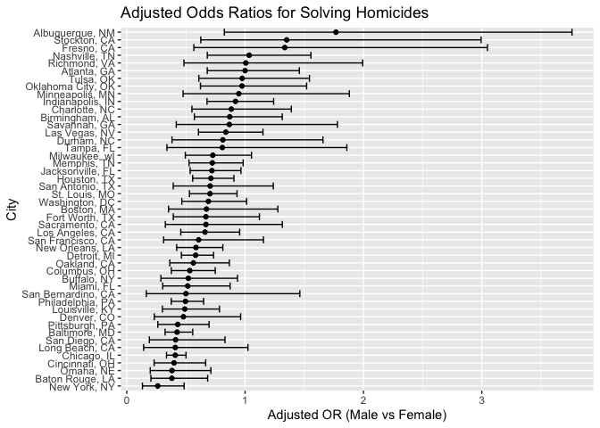
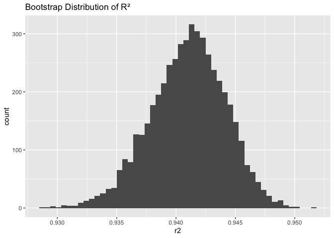
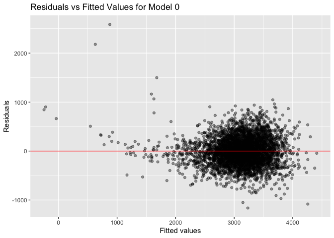
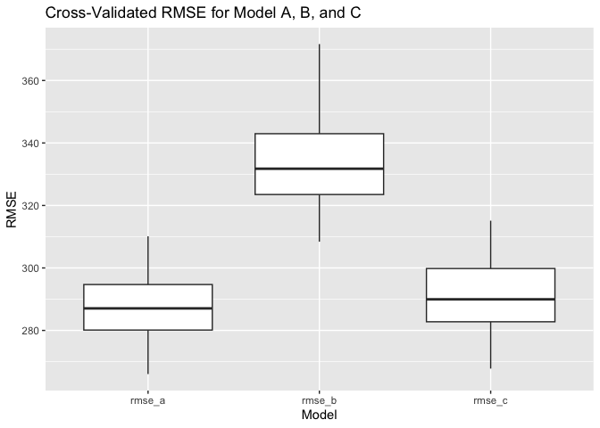

hw6
================

``` r
library(janitor)
```

    ## 
    ## Attaching package: 'janitor'

    ## The following objects are masked from 'package:stats':
    ## 
    ##     chisq.test, fisher.test

``` r
library(tidyverse)
```

    ## ── Attaching core tidyverse packages ──────────────────────── tidyverse 2.0.0 ──
    ## ✔ dplyr     1.1.4     ✔ readr     2.1.5
    ## ✔ forcats   1.0.0     ✔ stringr   1.5.1
    ## ✔ ggplot2   3.5.2     ✔ tibble    3.3.0
    ## ✔ lubridate 1.9.4     ✔ tidyr     1.3.1
    ## ✔ purrr     1.0.4

    ## ── Conflicts ────────────────────────────────────────── tidyverse_conflicts() ──
    ## ✖ dplyr::filter() masks stats::filter()
    ## ✖ dplyr::lag()    masks stats::lag()
    ## ℹ Use the conflicted package (<http://conflicted.r-lib.org/>) to force all conflicts to become errors

``` r
library(modelr)
```

# Problem 1

``` r
#load data,create city_state
homicide_raw = read_csv("homicide-data.csv") |> 
  clean_names() |> 
  mutate(
    city_state = str_c(city, state, sep = ", ")
  )
```

    ## Rows: 52179 Columns: 12
    ## ── Column specification ────────────────────────────────────────────────────────
    ## Delimiter: ","
    ## chr (9): uid, victim_last, victim_first, victim_race, victim_age, victim_sex...
    ## dbl (3): reported_date, lat, lon
    ## 
    ## ℹ Use `spec()` to retrieve the full column specification for this data.
    ## ℹ Specify the column types or set `show_col_types = FALSE` to quiet this message.

``` r
homicide_df = homicide_raw |>
  mutate(
    victim_age = na_if(victim_age, "Unknown"), 
    victim_age = as.numeric(victim_age),  
  ) |>
  filter(    
    !(city_state %in% c("Tulsa, AL", "Dallas, TX", "Phoenix, AZ", "Kansas City, MO")),
    victim_race %in% c("White", "Black"))
```

``` r
baltimore_df = homicide_df |>
  filter(city_state == "Baltimore, MD") |>
  mutate(
    solved_bin = if_else(disposition == "Closed by arrest", 1, 0)
  )

fit_baltimore = glm(
  solved_bin ~ victim_age + victim_sex + victim_race,
  data = baltimore_df,
  family = binomial
)

balt_results = fit_baltimore |>
  broom::tidy(conf.int = TRUE, exponentiate = TRUE)

baltimore_or = balt_results |>
  filter(term == "victim_sexMale") |>
  select(estimate, conf.low, conf.high)
```

``` r
city_nested = homicide_df |>
  mutate(
    solved_bin = if_else(disposition == "Closed by arrest", 1, 0)
  ) |>
  group_by(city_state) |>
  nest()

city_models = city_nested |>
  mutate(
    model = map(data, ~ glm(
      solved_bin ~ victim_age + victim_sex + victim_race,
      data = .x,
      family = binomial
    )),
    results = map(model, ~ broom::tidy(.x, conf.int = TRUE, exponentiate = TRUE))
  ) |>
  unnest(results) |>
  filter(term == "victim_sexMale") |>
  select(city_state, estimate, conf.low, conf.high)
```

    ## Warning: There were 43 warnings in `mutate()`.
    ## The first warning was:
    ## ℹ In argument: `results = map(model, ~broom::tidy(.x, conf.int = TRUE,
    ##   exponentiate = TRUE))`.
    ## ℹ In group 1: `city_state = "Albuquerque, NM"`.
    ## Caused by warning:
    ## ! glm.fit: fitted probabilities numerically 0 or 1 occurred
    ## ℹ Run `dplyr::last_dplyr_warnings()` to see the 42 remaining warnings.

``` r
ggplot(city_models, aes(
  x = estimate,
  y = fct_reorder(city_state, estimate)
)) +
  geom_point() +
  geom_errorbarh(aes(xmin = conf.low, xmax = conf.high)) +
  labs(
    x = "Adjusted OR (Male vs Female)",
    y = "City",
    title = "Adjusted Odds Ratios for Solving Homicides"
  )
```

<!-- -->

\#Problem 2

``` r
library(p8105.datasets)
data("weather_df")
```

``` r
boot_sample = function(data) {
    sampled = sample_frac(data, replace = TRUE)
    fit = lm(tmax ~ tmin + prcp, data = sampled)
    r2 = broom::glance(fit)$r.squared
    coefs = broom::tidy(fit)
    beta1 = coefs |> filter(term == "tmin") |> pull(estimate)
    beta2 = coefs |> filter(term == "prcp") |> pull(estimate)
    ratio = beta1 / beta2
    tibble(
    r2 = r2,
    ratio = ratio
  )
}
```

``` r
set.seed(8105)
boot_results = 
  map(1:5000, ~ boot_sample(weather_df)) |>
  bind_rows()
```

``` r
ggplot(boot_results, aes(x = r2)) +
  geom_histogram(bins = 50) +
  labs(title = "Bootstrap Distribution of R²")
```

<!-- -->

``` r
ggplot(boot_results, aes(x = ratio)) +
  geom_histogram(bins = 50) +
  labs(title = "Bootstrap Distribution of β1 / β2")
```

<!-- -->

``` r
boot_results |>
  summarize(
    r2_lower = quantile(r2, 0.025),
    r2_upper = quantile(r2, 0.975),
    ratio_lower = quantile(ratio, 0.025),
    ratio_upper = quantile(ratio, 0.975)
  )
```

    ## # A tibble: 1 × 4
    ##   r2_lower r2_upper ratio_lower ratio_upper
    ##      <dbl>    <dbl>       <dbl>       <dbl>
    ## 1    0.934    0.947       -277.       -124.

The bootstrap distribution of R^2 is tightly concentrated around 0.94,
and the 95% confidence interval (0.934–0.947) indicates that the model
consistently explains a large proportion of the variation in `tmax`. The
distribution of β1/β2 is wide and entirely negative, with a 95% CI of
–277 to –124, reflecting the positive effect of `tmin` and the small
negative effect of `prcp` in the fitted model.

\#Problem 3

``` r
birthweight_df = 
  read_csv("birthweight.csv") |>
  janitor::clean_names()
```

    ## Rows: 4342 Columns: 20
    ## ── Column specification ────────────────────────────────────────────────────────
    ## Delimiter: ","
    ## dbl (20): babysex, bhead, blength, bwt, delwt, fincome, frace, gaweeks, malf...
    ## 
    ## ℹ Use `spec()` to retrieve the full column specification for this data.
    ## ℹ Specify the column types or set `show_col_types = FALSE` to quiet this message.

``` r
birthweight_df = birthweight_df |>
  mutate(
    babysex = factor(babysex),
    frace = factor(frace),
    mrace = factor(mrace),
    malform = factor(malform)
  )
#check NA
birthweight_df |> 
  summarize(across(everything(), ~ sum(is.na(.x))))
```

    ## # A tibble: 1 × 20
    ##   babysex bhead blength   bwt delwt fincome frace gaweeks malform menarche
    ##     <int> <int>   <int> <int> <int>   <int> <int>   <int>   <int>    <int>
    ## 1       0     0       0     0     0       0     0       0       0        0
    ## # ℹ 10 more variables: mheight <int>, momage <int>, mrace <int>, parity <int>,
    ## #   pnumlbw <int>, pnumsga <int>, ppbmi <int>, ppwt <int>, smoken <int>,
    ## #   wtgain <int>

To begin, I loaded the birthweight dataset, standardized variable names
using clean_names(), and converted several categorical variables (such
as baby sex, mother’s race, and malformation status) to factors to
reflect their qualitative structure. I then verified that no variables
contained missing values, ensuring that all observations could be
included directly in the regression modeling without requiring
additional preprocessing or imputation.

``` r
#model a
model_a = lm(
  bwt ~ blength + bhead + gaweeks + smoken + ppbmi + babysex,
  data = birthweight_df
)

summary(model_a)
```

    ## 
    ## Call:
    ## lm(formula = bwt ~ blength + bhead + gaweeks + smoken + ppbmi + 
    ##     babysex, data = birthweight_df)
    ## 
    ## Residuals:
    ##      Min       1Q   Median       3Q      Max 
    ## -1162.99  -187.92   -10.68   177.50  2583.85 
    ## 
    ## Coefficients:
    ##               Estimate Std. Error t value Pr(>|t|)    
    ## (Intercept) -6292.7291   100.2730 -62.756  < 2e-16 ***
    ## blength        81.2818     2.0814  39.052  < 2e-16 ***
    ## bhead         139.9865     3.5676  39.239  < 2e-16 ***
    ## gaweeks        14.4461     1.5148   9.536  < 2e-16 ***
    ## smoken         -1.7887     0.5878  -3.043 0.002357 ** 
    ## ppbmi           3.4736     1.3664   2.542 0.011050 *  
    ## babysex2       32.0364     8.8347   3.626 0.000291 ***
    ## ---
    ## Signif. codes:  0 '***' 0.001 '**' 0.01 '*' 0.05 '.' 0.1 ' ' 1
    ## 
    ## Residual standard error: 285.3 on 4335 degrees of freedom
    ## Multiple R-squared:  0.6902, Adjusted R-squared:  0.6898 
    ## F-statistic:  1610 on 6 and 4335 DF,  p-value: < 2.2e-16

In this model, I chose to include important physical predictors of fetal
growth (blength, bhead, gaweeks, babysex) as well as maternal factors
that affect birthweight (smoken, ppbmi). These variables are medically
reasonable and expected to have strong associations with birthweight.

``` r
mod_a_df = birthweight_df |>
  add_predictions(model_a) |>
  add_residuals(model_a)

ggplot(mod_a_df, aes(x = pred, y = resid)) +
  geom_point(alpha = 0.4) +
  geom_hline(yintercept = 0, color = "red") +
  labs(
    title = "Residuals vs Fitted Values for Model 0",
    x = "Fitted values",
    y = "Residuals"
  )
```

<!-- --> The
residuals-versus-fitted plot for Model A shows a fairly random scatter
of points around zero, with no strong curvature or increasing spread.
This suggests that the linearity and constant-variance assumptions are
reasonably satisfied, and there is no obvious evidence of systematic
model misspecification. Overall, the plot indicates that Model A
provides an adequate fit to the data.

``` r
#model b and c
model_b = lm(bwt ~ blength + gaweeks, data = birthweight_df)
summary(model_b)
```

    ## 
    ## Call:
    ## lm(formula = bwt ~ blength + gaweeks, data = birthweight_df)
    ## 
    ## Residuals:
    ##     Min      1Q  Median      3Q     Max 
    ## -1709.6  -215.4   -11.4   208.2  4188.8 
    ## 
    ## Coefficients:
    ##              Estimate Std. Error t value Pr(>|t|)    
    ## (Intercept) -4347.667     97.958  -44.38   <2e-16 ***
    ## blength       128.556      1.990   64.60   <2e-16 ***
    ## gaweeks        27.047      1.718   15.74   <2e-16 ***
    ## ---
    ## Signif. codes:  0 '***' 0.001 '**' 0.01 '*' 0.05 '.' 0.1 ' ' 1
    ## 
    ## Residual standard error: 333.2 on 4339 degrees of freedom
    ## Multiple R-squared:  0.5769, Adjusted R-squared:  0.5767 
    ## F-statistic:  2958 on 2 and 4339 DF,  p-value: < 2.2e-16

``` r
model_c = lm(bwt ~ bhead * blength * babysex, data = birthweight_df)
summary(model_c)
```

    ## 
    ## Call:
    ## lm(formula = bwt ~ bhead * blength * babysex, data = birthweight_df)
    ## 
    ## Residuals:
    ##      Min       1Q   Median       3Q      Max 
    ## -1132.99  -190.42   -10.33   178.63  2617.96 
    ## 
    ## Coefficients:
    ##                          Estimate Std. Error t value Pr(>|t|)    
    ## (Intercept)            -7176.8170  1264.8397  -5.674 1.49e-08 ***
    ## bhead                    181.7956    38.0542   4.777 1.84e-06 ***
    ## blength                  102.1269    26.2118   3.896 9.92e-05 ***
    ## babysex2                6374.8684  1677.7669   3.800 0.000147 ***
    ## bhead:blength             -0.5536     0.7802  -0.710 0.478012    
    ## bhead:babysex2          -198.3932    51.0917  -3.883 0.000105 ***
    ## blength:babysex2        -123.7729    35.1185  -3.524 0.000429 ***
    ## bhead:blength:babysex2     3.8781     1.0566   3.670 0.000245 ***
    ## ---
    ## Signif. codes:  0 '***' 0.001 '**' 0.01 '*' 0.05 '.' 0.1 ' ' 1
    ## 
    ## Residual standard error: 287.7 on 4334 degrees of freedom
    ## Multiple R-squared:  0.6849, Adjusted R-squared:  0.6844 
    ## F-statistic:  1346 on 7 and 4334 DF,  p-value: < 2.2e-16

``` r
set.seed(8105)

cv_df =
  crossv_mc(birthweight_df, 100) |>
  mutate(
    train = map(train, as_tibble),
    test = map(test, as_tibble)
  )

cv_results =
  cv_df |>
  mutate(
    mod_a_fit = map(train, ~ lm(bwt ~ blength + bhead + gaweeks + smoken + ppbmi + babysex, data = .x)),
    mod_b_fit = map(train, ~ lm(bwt ~ blength + gaweeks, data = .x)),
    mod_c_fit = map(train, ~ lm(bwt ~ bhead * blength * babysex, data = .x))
  ) |>
  mutate(
    rmse_a = map2_dbl(mod_a_fit, test, ~ sqrt(mean((.y$bwt - predict(.x, .y))^2))),
    rmse_b = map2_dbl(mod_b_fit, test, ~ sqrt(mean((.y$bwt - predict(.x, .y))^2))),
    rmse_c = map2_dbl(mod_c_fit, test, ~ sqrt(mean((.y$bwt - predict(.x, .y))^2)))
  )
```

``` r
cv_results |>
  select(rmse_a, rmse_b, rmse_c) |>
  pivot_longer(everything(), names_to = "model", values_to = "rmse") |>
  ggplot(aes(x = model, y = rmse)) +
  geom_boxplot() +
  labs(
    title = "Cross-Validated RMSE for Model A, B, and C",
    x = "Model",
    y = "RMSE"
  )
```

<!-- -->

``` r
cv_results |>
  summarize(
    mean_a = mean(rmse_a),
    mean_b = mean(rmse_b),
    mean_c = mean(rmse_c)
  )
```

    ## # A tibble: 1 × 3
    ##   mean_a mean_b mean_c
    ##    <dbl>  <dbl>  <dbl>
    ## 1   287.   334.   291.

From the plot and the numerical results, it showed Model A had the
lowest mean RMSE (287), followed by Model C (291), while Model B
performed substantially worse with a mean RMSE of 334. These results
indicate that Model A provides the best predictive accuracy among the
three models when doin across the 100 Monte Carlo splits.
